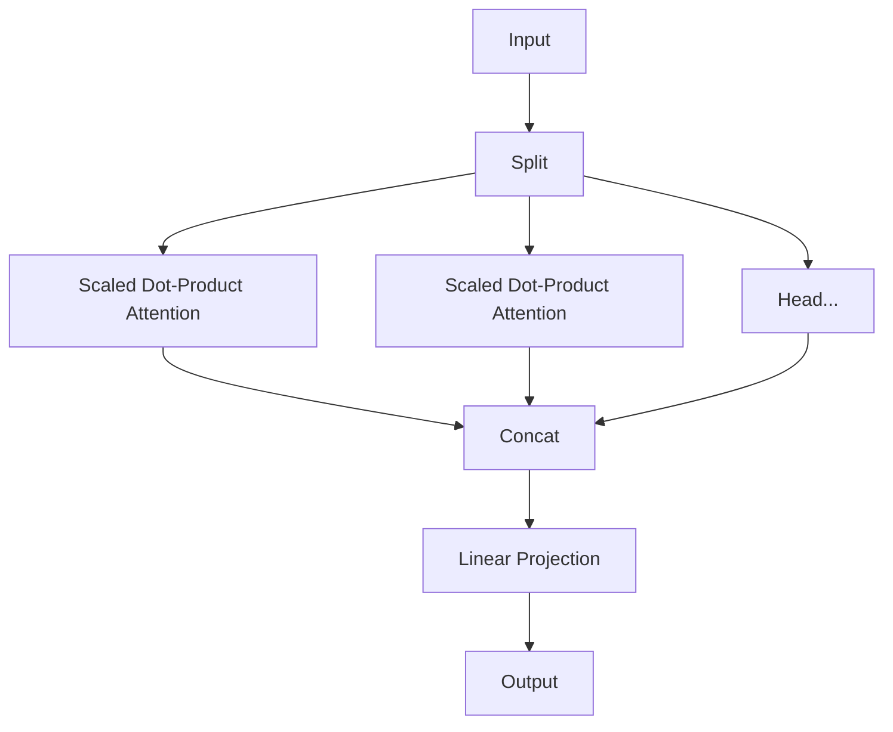

# Transformer & Attention Foundations

The **Transformer** architecture, introduced in the seminal paper *[Attention Is All You Need](https://arxiv.org/abs/1706.03762)* (Vaswani et al., 2017), revolutionized natural language processing by dispensing with recurrence and convolutions entirely.

This deep dive covers the mathematical and implementation foundations of the Transformer, focusing on the mechanism that powers it all: **Self-Attention**.

## 1. The Bottleneck of Recurrence

Prior to Transformers, Sequence-to-Sequence (Seq2Seq) tasks were dominated by RNNS (LSTMs/GRUs). These suffered from a critical limitation: **Sequential Computation**.

*   **Sequentiality**: $h_t$ depends on $h_{t-1}$, preventing parallelization across time steps.
*   **Long-term Dependencies**: Information must flow through $O(N)$ steps to connect distant words.

Transformers process the entire sequence **in parallel**, reducing path length between any two positions to $O(1)$.

## 2. Scaled Dot-Product Attention

The core engine of the Transformer is the attention mechanism. It allows the model to weigh the importance of different tokens in the input sequence when processing a specific token.

### The Query-Key-Value Abstraction

We map the input vectors into three distinct spaces:

*   **Query ($Q$)**: What I am looking for?
*   **Key ($K$)**: What can I offer?
*   **Value ($V$)**: What is my actual content?

### Mathematical Formulation

Given a query matrix $Q$, key matrix $K$, and value matrix $V$, the attention scores are calculated as:

$$
\text{Attention}(Q, K, V) = \text{softmax}\left(\frac{QK^T}{\sqrt{d_k}}\right)V
$$

Where:
*   $Q, K \in \mathbb{R}^{n \times d_k}$
*   $V \in \mathbb{R}^{n \times d_v}$
*   $d_k$ is the dimension of the key vectors.

!!! note "Why Scale by $\sqrt{d_k}$?"
    As $d_k$ increases, the dot products $q \cdot k$ can grow large in magnitude. This pushes the softmax function into regions where gradients are extremely small (vanishing gradients). Scaling by $\frac{1}{\sqrt{d_k}}$ keeps the variance stable.

### Implementation

```python
import torch
import torch.nn.functional as F
import math

def scaled_dot_product_attention(query, key, value, mask=None):
    """
    Args:
        query: [batch_size, num_heads, seq_len, d_k]
        key:   [batch_size, num_heads, seq_len, d_k]
        value: [batch_size, num_heads, seq_len, d_k]
        mask:  [batch_size, 1, 1, seq_len] (Optional)
    """
    d_k = query.size(-1)
    
    # 1. Compute unnormalized scores
    scores = torch.matmul(query, key.transpose(-2, -1)) \
             / math.sqrt(d_k)
    
    # 2. Apply masking (if provided) for decoder or padding
    if mask is not None:
        scores = scores.masked_fill(mask == 0, -1e9)
    
    # 3. Softmax to get probabilities
    attn_weights = F.softmax(scores, dim=-1)
    
    # 4. Weighted sum of values
    output = torch.matmul(attn_weights, value)
    
    return output, attn_weights
```

## 3. Multi-Head Attention (MHA)

A single attention head might focus on a specific relationship (e.g., subject-verb). To capture multiple types of relationships simultaneously, we use **Multi-Head Attention**.

We project the queries, keys, and values into $h$ different subspaces, perform attention in parallel, and then concat the results.

$$
\begin{aligned}
\text{MultiHead}(Q, K, V) &= \text{Concat}(\text{head}_1, \dots, \text{head}_h)W^O \\
\text{where } \text{head}_i &= \text{Attention}(QW_i^Q, KW_i^K, VW_i^V)
\end{aligned}
$$

### Diagram



## 4. Positional Encoding

Since the Transformer contains no recurrence and no convolution, it has no inherent sense of order. To give the model information about the position of the tokens, we inject **Positional Encodings** at the input embeddings.

The original paper uses sine and cosine functions of different frequencies:

$$
\begin{aligned}
PE_{(pos, 2i)} &= \sin(pos / 10000^{2i/d_{\text{model}}}) \\
PE_{(pos, 2i+1)} &= \cos(pos / 10000^{2i/d_{\text{model}}})
\end{aligned}
$$

This allows the model to learn to attend by relative positions, as for any fixed offset $k$, $PE_{pos+k}$ can be represented as a linear function of $PE_{pos}$.

## 5. The Architecture Components

A full Transformer block consists of two main sub-layers:

1.  **Multi-Head Self-Attention**
2.  **Position-wise Feed-Forward Networks** (FFN)

$$
\text{FFN}(x) = \max(0, xW_1 + b_1)W_2 + b_2
$$

Each sub-layer has a residual connection followed by layer normalization:

$$
\text{LayerOutput}(x) = \text{LayerNorm}(x + \text{Sublayer}(x))
$$

!!! warning "Pre-Norm vs Post-Norm"
    The original paper used **Post-Norm** (putting LayerNorm after the residual block). Modern LLMs (like GPT-3, Llama 2) typically use **Pre-Norm** (putting LayerNorm before the sub-layer) for better training stability.

## 6. Summary

The Transformer replaces recurrence with Attention. This shift enabled:

1.  **Massive Parallelism**: Training on TPU pods/GPU clusters.
2.  **Global Receptive Field**: Instant access to any part of the context.
3.  **Foundation Models**: The ability to scale to billions of parameters (GPT, Claude, Gemini).
