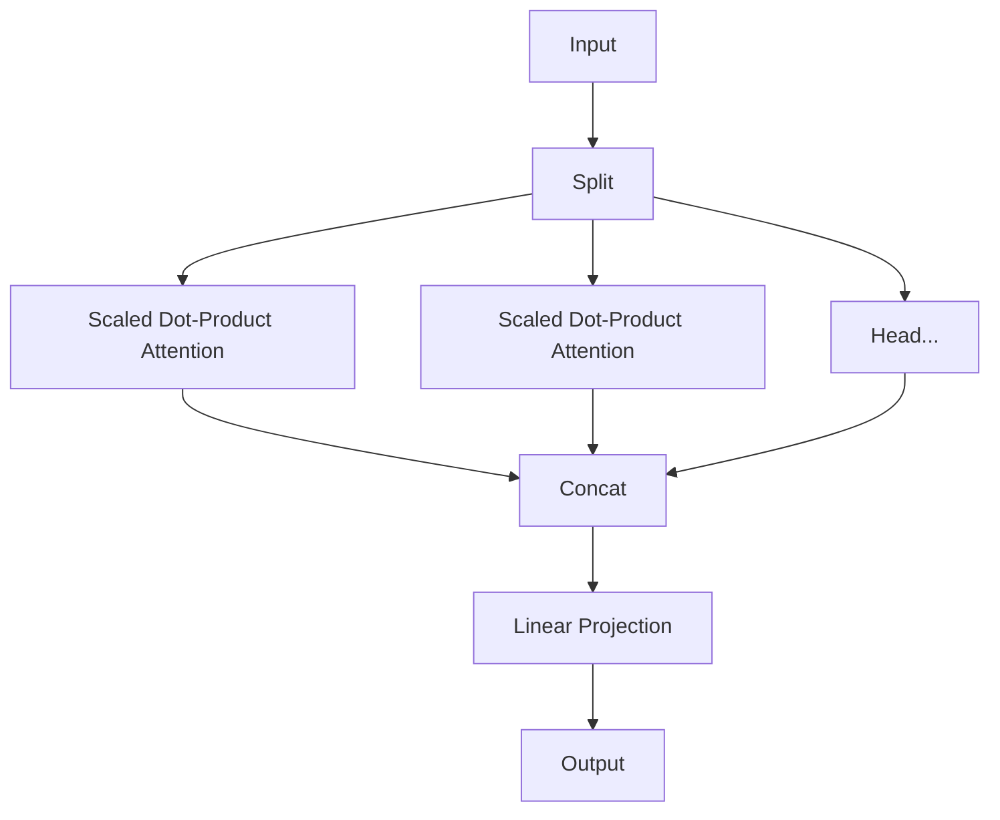

# Transformer & Attention Foundations

=== "English"

    The **Transformer** architecture, introduced in the seminal paper *[Attention Is All You Need](https://arxiv.org/abs/1706.03762)* (Vaswani et al., 2017), revolutionized natural language processing by dispensing with recurrence and convolutions entirely.

    This deep dive covers the mathematical and implementation foundations of the Transformer, focusing on the mechanism that powers it all: **Self-Attention**.

=== "Tiếng Việt"

    Kiến trúc **Transformer**, được giới thiệu trong bài báo mang tính nền tảng *Attention Is All You Need* (Vaswani et al., 2017), đã tạo ra một bước ngoặt quan trọng trong lĩnh vực xử lý ngôn ngữ tự nhiên khi **loại bỏ hoàn toàn** các cơ chế đệ quy (recurrence) và tích chập (convolution).

    Bài viết này trình bày có hệ thống các nền tảng **toán học**, **trực giác**, và **triển khai thực tế** của Transformer, tập trung vào cơ chế trung tâm quyết định hiệu năng của mô hình: **Self-Attention** (cơ chế tự chú ý).


## 1. The Bottleneck of Recurrence / Nút thắt của mô hình đệ quy

=== "English"

    Prior to Transformers, Sequence-to-Sequence (Seq2Seq) tasks were dominated by RNNS (LSTMs/GRUs). These suffered from a critical limitation: **Sequential Computation**.

    *   **Sequentiality**: $h_t$ depends on $h_{t-1}$, preventing parallelization across time steps.
    *   **Long-term Dependencies**: Information must flow through $O(N)$ steps to connect distant words.

    Transformers process the entire sequence **in parallel**, reducing path length between any two positions to $O(1)$.

=== "Tiếng Việt"

    Trước khi Transformer ra đời, các bài toán Sequence-to-Sequence (Seq2Seq) chủ yếu sử dụng các mô hình dựa trên RNN (LSTM/GRU). Những mô hình này gặp một hạn chế mang tính cấu trúc: **tính toán tuần tự**.

    *   **Tính tuần tự (Sequentiality)**: Trạng thái ẩn $h_t$ phụ thuộc vào $h_{t-1}$, khiến việc song song hóa theo chiều thời gian là không khả thi.
    *   **Phụ thuộc dài hạn (Long-term dependencies)**: Thông tin phải đi qua $O(N)$ bước để liên kết các token ở xa nhau, làm suy giảm khả năng học quan hệ dài hạn.

    Transformer xử lý toàn bộ chuỗi **song song**, đồng thời rút ngắn độ dài đường truyền thông tin giữa hai vị trí bất kỳ xuống còn $O(1)$.

## 2. Scaled Dot-Product Attention / Cơ chế Scaled Dot-Product Attention

=== "English"

    The core engine of the Transformer is the attention mechanism. It allows the model to weigh the importance of different tokens in the input sequence when processing a specific token.

    ### The Query-Key-Value Abstraction

    We map the input vectors into three distinct spaces:

    *   **Query ($Q$)**: What I am looking for?
    *   **Key ($K$)**: What can I offer?
    *   **Value ($V$)**: What is my actual content?

    ### Mathematical Formulation

    Given a query matrix $Q$, key matrix $K$, and value matrix $V$, the attention scores are calculated as:

    $$
    \text{Attention}(Q, K, V) = \text{softmax}\left(\frac{QK^T}{\sqrt{d_k}}\right)V
    $$

    Where $d_k$ is the dimension of the key vectors.

    !!! note "Why Scale by $\sqrt{d_k}$?"
        As $d_k$ increases, the dot products $q \cdot k$ can grow large in magnitude. This pushes the softmax function into regions where gradients are extremely small (vanishing gradients). Scaling by $\frac{1}{\sqrt{d_k}}$ keeps the variance stable.

=== "Tiếng Việt"

    Thành phần cốt lõi của Transformer là **cơ chế Attention**. Cơ chế này cho phép mô hình **đánh trọng số mức độ liên quan** giữa các token trong chuỗi khi biểu diễn một token cụ thể.

    ### Trừu tượng Query–Key–Value (QKV)

    Các biểu diễn đầu vào được chiếu tuyến tính sang ba không gian vector khác nhau:

    *   **Query ($Q$)**: Biểu diễn thông tin mà token hiện tại đang truy vấn.
    *   **Key ($K$)**: Biểu diễn thông tin dùng để so khớp (matching) với query.
    *   **Value ($V$)**: Biểu diễn nội dung thông tin thực sự sẽ được tổng hợp.

    ### Công thức toán học

    $$
    \text{Attention}(Q, K, V) = \text{softmax}\left(\frac{QK^T}{\sqrt{d_k}}\right)V
    $$

    Trong đó $d_k$ là số chiều của vector key.

    !!! note "Vì sao cần chuẩn hóa theo $\sqrt{d_k}$?"
        Khi $d_k$ tăng, tích vô hướng $q \cdot k$ có xu hướng có độ lớn lớn hơn, khiến hàm softmax rơi vào vùng bão hòa và làm gradient trở nên rất nhỏ. Việc chia cho $\sqrt{d_k}$ giúp ổn định phương sai của điểm attention và cải thiện quá trình huấn luyện.

## 2.1 Intuition of Attention / Trực giác về Attention

=== "English"

    Attention can be viewed as a **soft, differentiable lookup mechanism**. For a given query, the model searches over all keys, determines their relevance, and aggregates the corresponding values.

=== "Tiếng Việt"


    Attention có thể được hiểu như một **cơ chế tra cứu mềm (soft lookup)** và khả vi.  
    Với mỗi token đang xét (query), mô hình:

    1. So sánh query với **tất cả key** trong chuỗi.
    2. Đánh giá mức độ liên quan thông qua tích vô hướng.
    3. Chuẩn hóa các mức độ liên quan bằng softmax.
    4. Tổng hợp thông tin từ các value theo trọng số tương ứng.

    Nói cách khác, mỗi token **tự quyết định nên “chú ý” đến những token nào khác** khi xây dựng biểu diễn của chính nó.


## 2.2 Visualization of Attention / Hình dung cơ chế Attention

=== "English"

    Each token attends to all other tokens with different strengths, forming a weighted dependency graph.

=== "Tiếng Việt"


    Có thể hình dung Attention như một **đồ thị phụ thuộc đầy đủ**:

    - Mỗi token là một nút.
    - Mỗi cặp token có một cạnh có trọng số (attention weight).
    - Trọng số càng lớn → mức độ ảnh hưởng càng cao.

    Ví dụ (mô tả khái niệm):

    Token “it” trong câu  
    “The animal didn’t cross the street because **it** was tired”

    sẽ gán trọng số attention cao cho “animal” và thấp cho “street”, giúp mô hình giải quyết bài toán đồng tham chiếu (coreference).

### Implementation / Triển khai code

```python
import torch
import torch.nn.functional as F
import math

def scaled_dot_product_attention(query, key, value, mask=None):
    """
    Args:
        query: [batch_size, num_heads, seq_len, d_k]
        key:   [batch_size, num_heads, seq_len, d_k]
        value: [batch_size, num_heads, seq_len, d_k]
        mask:  [batch_size, 1, 1, seq_len] (Optional)
    """
    d_k = query.size(-1)
    
    # 1. Compute unnormalized scores
    scores = torch.matmul(query, key.transpose(-2, -1)) \
             / math.sqrt(d_k)
    
    # 2. Apply masking (if provided) for decoder or padding
    if mask is not None:
        scores = scores.masked_fill(mask == 0, -1e9)
    
    # 3. Softmax to get probabilities
    attn_weights = F.softmax(scores, dim=-1)
    
    # 4. Weighted sum of values
    output = torch.matmul(attn_weights, value)
    
    return output, attn_weights
```

## 3. Multi-Head Attention (MHA) / Cơ chế chú ý đa đầu

=== "English"

    A single attention head might focus on a specific relationship (e.g., subject-verb). To capture multiple types of relationships simultaneously, we use **Multi-Head Attention**.

    We project the queries, keys, and values into $h$ different subspaces, perform attention in parallel, and then concat the results.

    $$
    \begin{aligned}
    \text{MultiHead}(Q, K, V) &= \text{Concat}(\text{head}_1, \dots, \text{head}_h)W^O \\
    \text{where } \text{head}_i &= \text{Attention}(QW_i^Q, KW_i^K, VW_i^V)
    \end{aligned}
    $$

=== "Tiếng Việt"

    Một đầu chú ý (attention head) đơn lẻ thường chỉ học được một kiểu quan hệ nhất định.  
    **Multi-Head Attention** cho phép mô hình:

    - Học **nhiều loại quan hệ song song**
    - Quan sát chuỗi từ nhiều không gian biểu diễn khác nhau
    - Kết hợp các góc nhìn này thành một biểu diễn giàu thông tin hơn

    Về mặt toán học:

    $$
    \begin{aligned}
    \text{MultiHead}(Q, K, V) &= \text{Concat}(\text{head}_1, \dots, \text{head}_h)W^O \\
    \text{head}_i &= \text{Attention}(QW_i^Q, KW_i^K, VW_i^V)
    \end{aligned}
    $$

### Diagram / Sơ đồ



## 4. Positional Encoding / Mã hóa vị trí

=== "English"

    Since the Transformer contains no recurrence and no convolution, it has no inherent sense of order. To give the model information about the position of the tokens, we inject **Positional Encodings** at the input embeddings.

    The original paper uses sine and cosine functions of different frequencies:

    $$
    \begin{aligned}
    PE_{(pos, 2i)} &= \sin(pos / 10000^{2i/d_{\text{model}}}) \\
    PE_{(pos, 2i+1)} &= \cos(pos / 10000^{2i/d_{\text{model}}})
    \end{aligned}
    $$

=== "Tiếng Việt"

    Do Transformer không có cơ chế nội tại để biểu diễn thứ tự, thông tin vị trí phải được **tiêm trực tiếp** vào embedding.

    Positional Encoding sử dụng các hàm sin và cos để đảm bảo:

    - Biểu diễn vị trí là liên tục
    - Có thể suy diễn cho chuỗi dài hơn khi suy luận

    $$
    \begin{aligned}
    PE_{(pos, 2i)} &= \sin\left(\frac{pos}{10000^{2i/d_{\text{model}}}}\right) \\
    PE_{(pos, 2i+1)} &= \cos\left(\frac{pos}{10000^{2i/d_{\text{model}}}}\right)
    \end{aligned}
    $$

## 5. Architecture Components / Các thành phần kiến trúc

=== "English"

    A full Transformer block consists of two main sub-layers:

    1.  **Multi-Head Self-Attention**
    2.  **Position-wise Feed-Forward Networks** (FFN)

    $$
    \text{FFN}(x) = \max(0, xW_1 + b_1)W_2 + b_2
    $$

    Each sub-layer has a residual connection followed by layer normalization:

    $$
    \text{LayerOutput}(x) = \text{LayerNorm}(x + \text{Sublayer}(x))
    $$

    !!! warning "Pre-Norm vs Post-Norm"
        The original paper used **Post-Norm** (putting LayerNorm after the residual block). Modern LLMs (like GPT-3, Llama 2) typically use **Pre-Norm** (putting LayerNorm before the sub-layer) for better training stability.

=== "Tiếng Việt"

    Một khối Transformer chuẩn bao gồm hai lớp phụ:

    1. **Multi-Head Self-Attention**
    2. **Position-wise Feed-Forward Network (FFN)**

    $$
    \text{FFN}(x) = \max(0, xW_1 + b_1)W_2 + b_2
    $$

    Mỗi lớp phụ được bao bọc bởi kết nối dư và chuẩn hóa lớp:

    $$
    \text{LayerOutput}(x) = \text{LayerNorm}(x + \text{Sublayer}(x))
    $$

    !!! warning "Pre-Norm vs Post-Norm"
        Các mô hình hiện đại ưu tiên **Pre-Norm** vì giúp gradient ổn định hơn và dễ huấn luyện ở quy mô lớn.


## 6. Summary / Tổng kết

=== "English"

    The Transformer replaces recurrence with Attention. This shift enabled:

    1.  **Massive Parallelism**: Training on TPU pods/GPU clusters.
    2.  **Global Receptive Field**: Instant access to any part of the context.
    3.  **Foundation Models**: The ability to scale to billions of parameters (GPT, Claude, Gemini).

=== "Tiếng Việt"

    Transformer thay thế hoàn toàn cơ chế đệ quy bằng Attention, mở ra một hướng tiếp cận mới cho mô hình chuỗi:

    1. **Song song hóa toàn diện**
    2. **Trường tiếp nhận toàn cục**
    3. **Khả năng mở rộng quy mô lớn**, tạo nền tảng cho các LLM hiện đại
